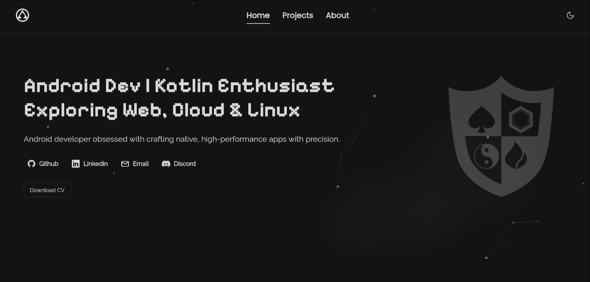
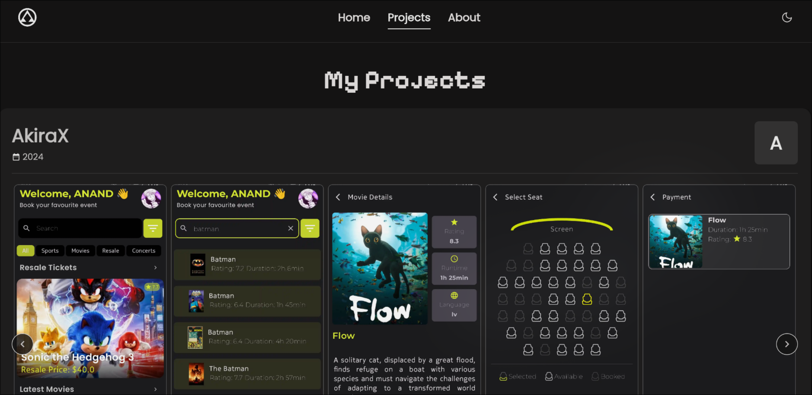
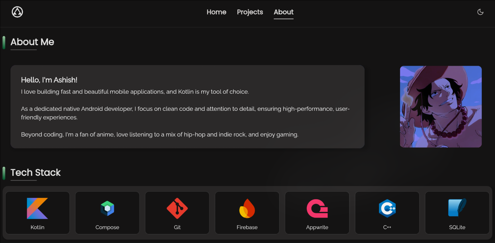

# PocKtfolio 🌐 🚀

A sleek, modern portfolio website built with Kotlin and Compose Multiplatform for Web.

## 📌 Overview  

PocKtfolio is a lightweight and responsive portfolio website.  
Built using Kotlin and Compose Multiplatform for Web, it delivers a smooth cross-platform experience while maintaining good performance.

## Screenshots



<br>



<br>



  

## 🔥 Features

- **Responsive Design** - Perfect display on any device from mobile to desktop
- **Dark/Light Mode** - Switch between themes with a single click
- **Interactive Project Gallery** - Showcase your work with a dynamic gallery
- **Animated UI Elements** - Subtle animations enhance user experience
- **Performance Optimized** - Fast loading times and smooth interactions

## 📦 Getting Started

### Installation

1. Clone the repository
```bash
git clone https://github.com/blizzardOfAce/pocKtfolio.git
cd pocKtfolio
```

2. Build the project
```bash
./gradlew build
```

3. Run locally
```bash
./gradlew wasmJsBrowserDevelopmentRun
```

4. Open your browser
```
http://localhost:8080/
```


## 🚀 Deployment

### Build for Production

```bash
./gradlew wasmJsBrowserProductionWebpack
```

The output will be in the `build/dist` directory.

### Deploy to Your Hosting

Upload the contents of the `build/dist/wasmJs` directory to your web host of choice:

- Vercel
- GitHub Pages
- Or any traditional web hosting

## 📱 Project Structure

```
composeApp/
├── src/
│   ├── commonMain/                      # Shared code across all platforms
│   │   ├── kotlin/
│   │   │   |
│   │   │   |   
│   │   │   └── org.apkmafia.pocktfolio/      # Your app-specific code
│   │   │            ├── network/     # Network-related components
│   │   │            ├── data/        # Data models
│   │   │            ├── ui/          # UI components and layouts
│   │   │            ├── App.kt       # App entry point and app-wide logic
│   │   │            └── Platform.kt  # Platform-specific configuration (for MPP)
│   │   └── composeResources/             # Static resources (shared across platforms)
│   └── wasmJsMain/                      # Web-specific code
│       ├── kotlin/
│       │   └── main/                    # Web entry point (JS specific)
│       └── resources/                   # Web-specific resources
├── build.gradle.kts                     # Gradle build configuration
└── settings.gradle.kts                  # Gradle settings

```

## 🤝 Contributing

Contributions are welcome! Please feel free to submit a Pull Request.

1. Fork the repository
2. Create your feature branch (`git checkout -b feature/amazing-feature`)
3. Commit your changes (`git commit -m 'Add some amazing feature'`)
4. Push to the branch (`git push origin feature/amazing-feature`)
5. Open a Pull Request
   

